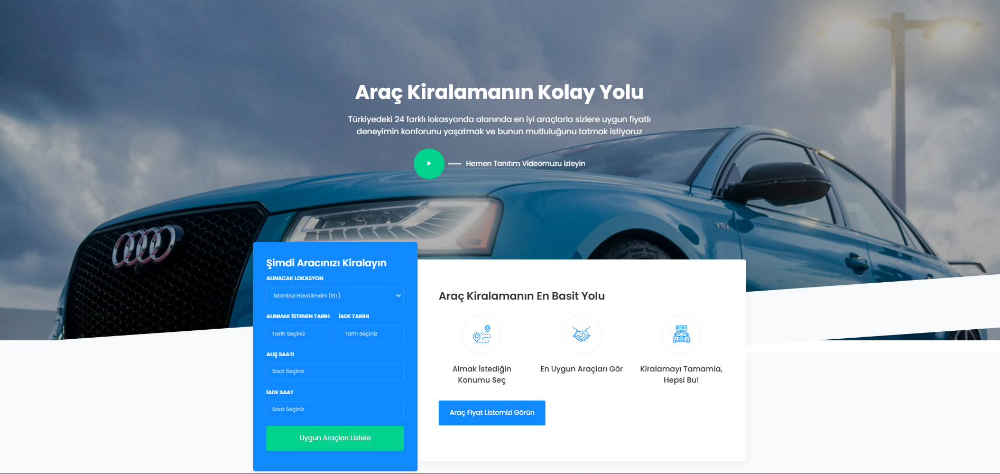
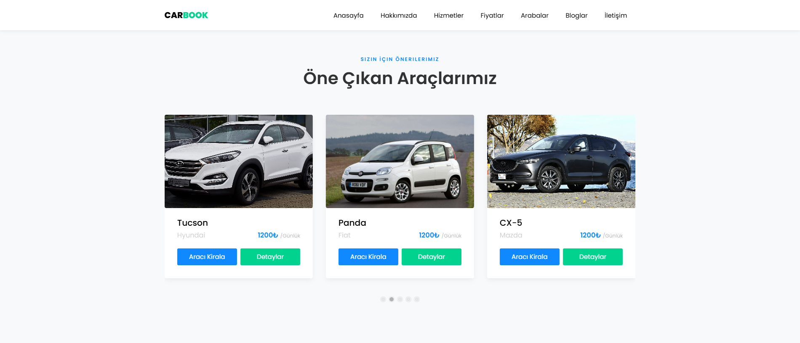
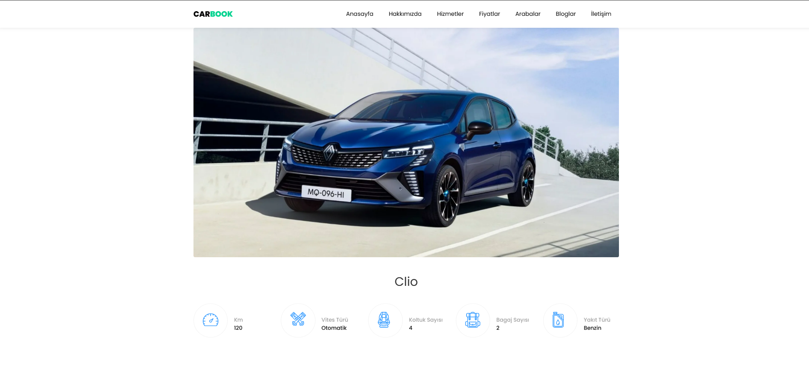
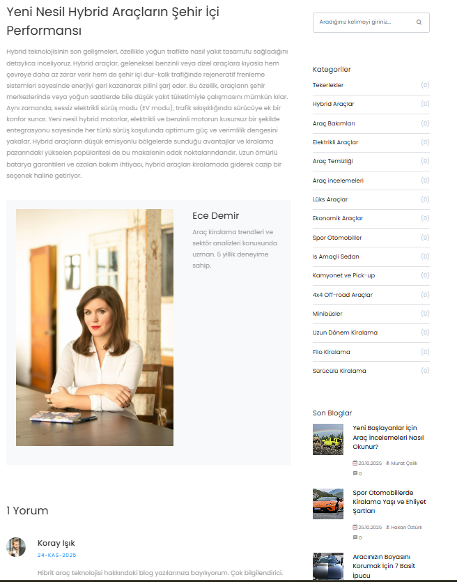
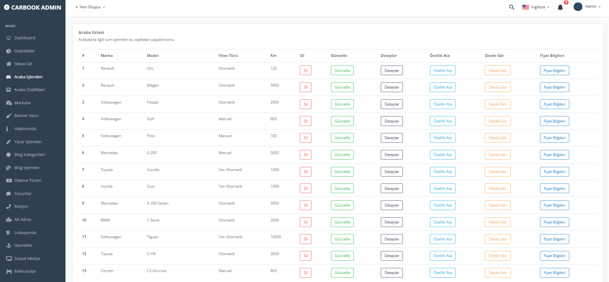

# 🚗 ASP.NET Core 8.0 – Modern Araç Kiralama ve Rezervasyon Sistemi

Bu proje, **ASP.NET Core 8.0** çatısı kullanılarak geliştirilmiş, **Onion Architecture** ve **CQRS** desenlerini benimseyen, tam kapsamlı ve dinamik bir araç kiralama ve rezervasyon platformudur. Güvenlik, modülerlik ve yüksek performans temel alınarak tasarlanmıştır.

## ✨ Proje Özellikleri ve Yetenekler

### ⚙️ Back-End Teknolojileri ve Mimarisi
| Kategori | Teknoloji / Desen | Açıklama |
| :--- | :--- | :--- |
| **Çatı** | **ASP.NET Core 8.0** | Modern ve güçlü .NET back-end çatısı (MVC ve Web API). |
| **Veri Mimarisi** | **Onion Architecture** | Modüler, test edilebilir ve sürdürülebilir katmanlı proje yapısı. |
| **Veri Yönetimi** | **CQRS & Mediator** | Komut (Command) ve Sorgu (Query) ayrımı ile verimli ve ölçeklenebilir veri işleme. (MediatR kullanılmıştır.) |
| **Veri Erişim** | **Repository Pattern** | Veri erişim mantığının soyutlanması ve temiz kod yapısı. |
| **Veritabanı** | **MSSQL & EF Core** | İlişkisel veritabanı altyapısı ve nesne-ilişkisel eşleyici. |
| **Güvenlik** | **JWT Authentication** | Token tabanlı, durum bilgisi olmayan güvenli kimlik doğrulama. |
| **Gerçek Zamanlı** | **SignalR** | Gerçek zamanlı bildirimler ve canlı veri aktarımı (örn. anlık rezervasyon durumu). |
| **Veri Transferi** | **DTO & AutoMapper** | Katmanlar arası güvenli ve kolay veri transferi (Data Transfer Object). |
| **Doğrulama** | **FluentValidation** | Veri modellerinde karmaşık ve okunaklı doğrulama kuralları. |
| **API Geliştirme** | **ASP.NET Web API** | RESTful servisler oluşturma ve verileri dış dünyaya açma. |
| **Test & Dokümantasyon** | **Swagger & Postman** | API uç noktalarının test edilmesi ve otomatik dokümantasyonu. |

### 🌐 Kullanıcı Arayüzü (UI) ve Ön Yüz
* **Arayüz Teknolojileri:** HTML5, CSS3, JavaScript.
* **Tasarım Çatısı:** **Bootstrap 5** ile modern ve duyarlı (responsive) arayüz tasarımı.
* **Dinamik Etkileşim:** **AJAX & jQuery** kullanılarak sayfa yenilenmeden dinamik veri çekme ve gönderme işlemleri.
* **Modüler Arayüz:** **ViewComponent & PartialView** ile yeniden kullanılabilir arayüz bileşenleri.

---

## 💻 Uygulama Katmanları

Proje, temel olarak iki ana bölümden oluşmaktadır:

### 1. 🖥️ Ana Sayfa (Misafir Görünümü)
Hiçbir giriş işlemi gerektirmeyen, halka açık bölümdür.

* Araç filtreleme ve kiralama işlemleri.
* Detaylı araç bilgileri ve görselleri.
* Firma detayları, fiyat listeleri ve blog içerikleri.
* İletişim ve rezervasyon formları.

**Misafir Ana Sayfa Görünümü**

**Araç Detay Sayfası**

**Blog Detay Sayfası**

### 2. 🛠️ Admin Paneli (Yönetici Görünümü)
Admin rolündeki kullanıcıların JWT ile giriş yaptığı, CRUD (Create, Read, Update, Delete) işlemlerini gerçekleştirdiği bölümdür.

* Araç, marka, lokasyon ve fiyat listesi yönetimi.
* Kullanıcı ve rol yönetimi.
* Blog ve diğer içerik bölümlerinin yönetimi.
* Gelen rezervasyon taleplerinin takibi.

**Admin Paneli - Dashboard**

**Admin Paneli - Araç İşlemleri**

**Admin Paneli - Araç Kiralama Ekranı**

